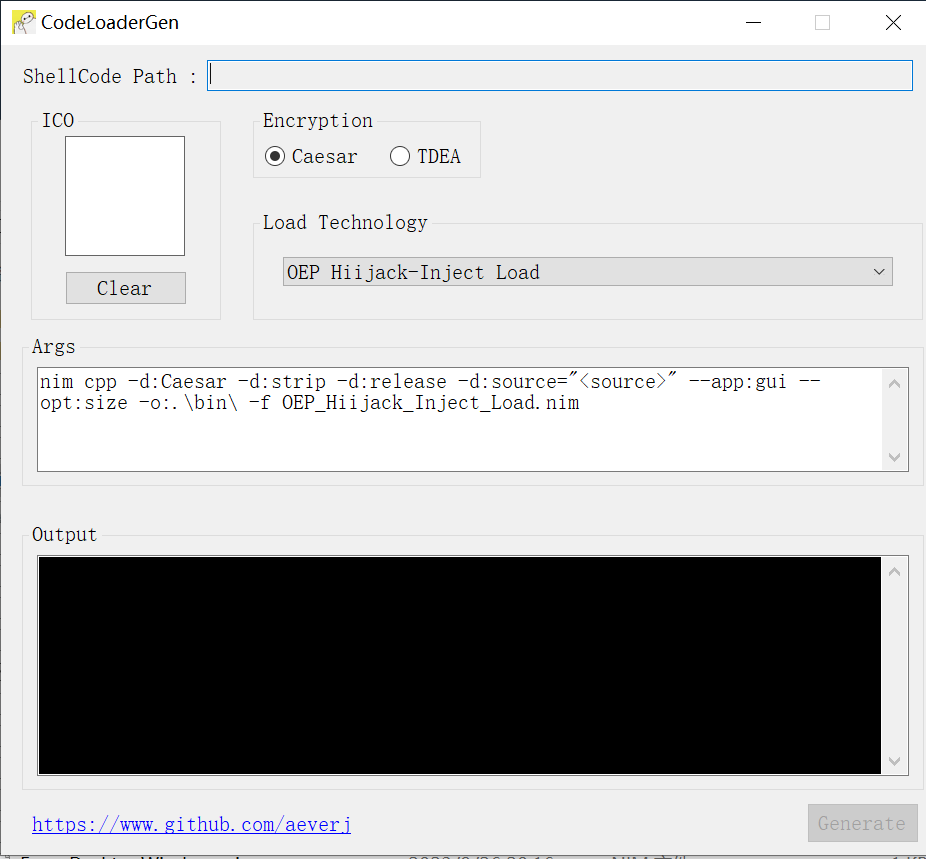
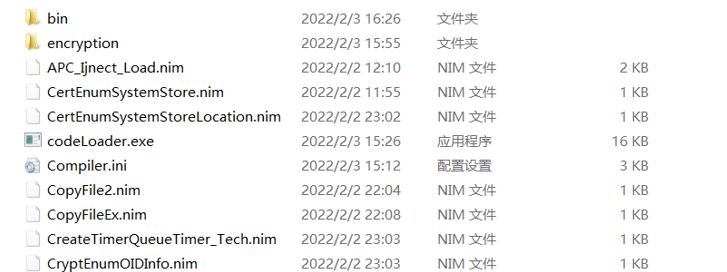
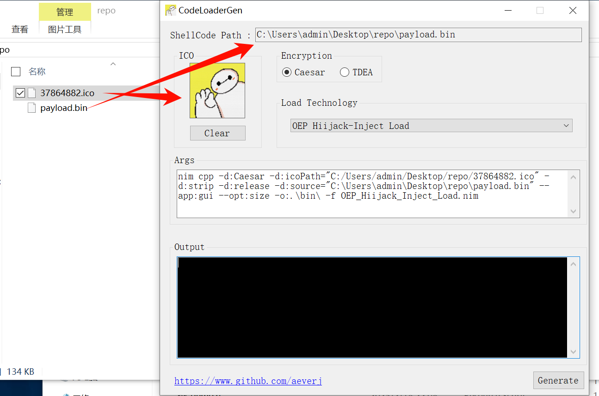
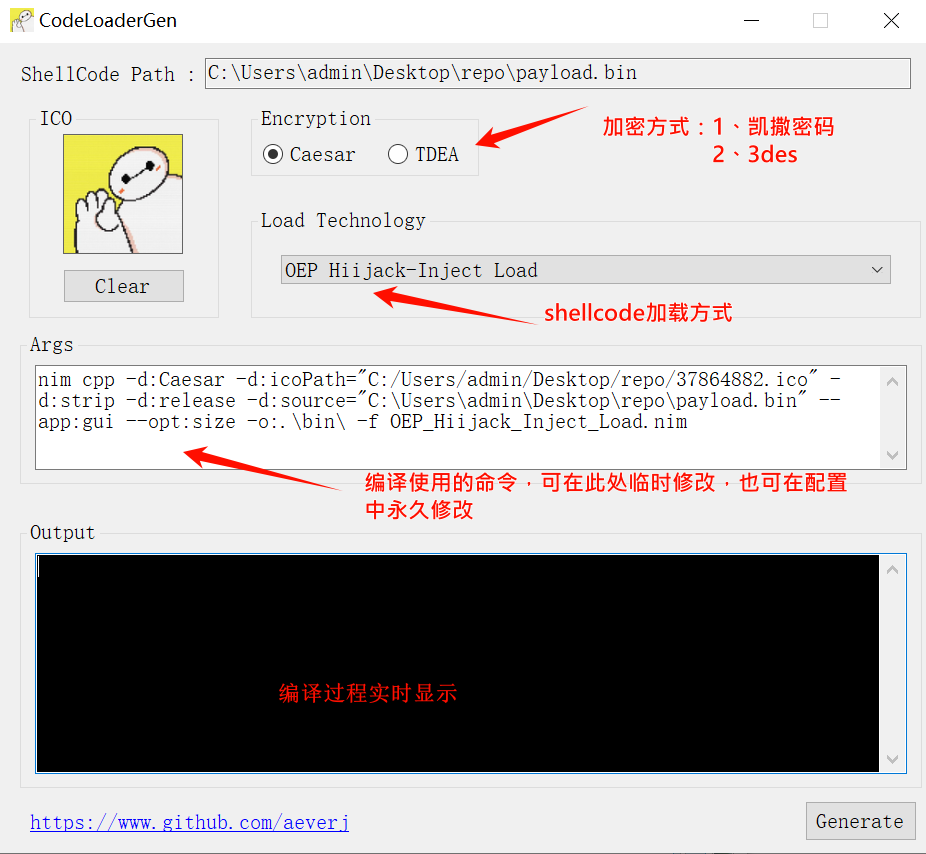
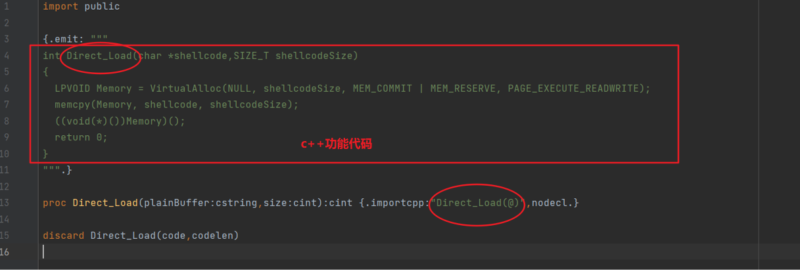
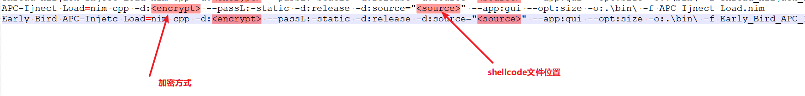

<h1 align="center"> NimShellCodeLoader</h1><h2 align="center">Nim编写Windows平台shellcode免杀加载器</h2>
快速生成免杀可执行文件

## 所获荣誉:

- [入选2022年KCon兵器谱](https://mp.weixin.qq.com/s/JohMsl1WD29LHCHuLf8mVQ)

## 更新：

**20231228：图标自定义功能**

**20230826：支持nim的v2.0版本，去除base64编码，减小文件生成体积**

**20220620：Fix Bug！增加2种加载`shellcode`方式**

**20220203：Fix Bug！增加14种加载`shellcode`方式，nim version>=1.6.2**

**20210123：增加三种加载`shellcode`方式，其中两种使用了[winim](https://github.com/khchen/winim)库，需要安装该库才能正常编译**

## 特点：

1：自带四种加载方式

2：可自行拓展加载方式

3：支持两种加密技术，分别位`3des`加密和凯撒密码，密钥随机，每次生成文件拥有不同hash

4：图标可以自定义

<h3 style="color: red;">仅限用于技术研究和获得正式授权的测试活动。</h3>

## 文件组成：

**`bin` 中存放生成的可执行文件**

**`encryption` 存放加密代码文件**

## 安装：

**1、安装`nim`最新版**
 - 从[下载页面](https://nim-lang.org/install_windows.html)，分别下载nim的安装包和编译器mingw64，将两者解压到任意目录，分别将两个文件夹里面的bin文件夹路径添加到path环境变量中
 - 打开命令行，输入nim回车，输入gcc或g++回车，返回正常即可之后正常使用nim来编译程序
 - 需要安装[winim](https://github.com/khchen/winim)

**2、下载本项目，分别编译`encryption`中的`Tdea.nim`和`Caesar.nim`。**

`nim c -d:release -d:strip --opt:size Tdea.nim`

`nim c -d:release -d:strip --opt:size Caesar.nim`

**3、编译c#项目，将可执行文件放到当前目录**

## 使用方法：

**1、打开生成器**

**2、将payload拖动到该窗口**

**3、选择加载方式，点击生成，可执行文件会保存到bin文件夹中**

## 拓展：

**1、新建`nim`代码文件，引用`public`，获取code（解密的明文shellcode）和`codelen`（明文shellcode长度）**

****

**2、以Direct Load为例，将c++的功能代码放到上图中方框内即可**

**3、修改`Compiler.ini`文件，添加一行，key为加载方式，value为编译使用的命令行，其中`<source>`为shellcode文件位置的占位符，`<encrypt>`为加密方式的占位符，其余可以自行定义。**

## 引用：

都是网上公开的方法

https://github.com/Moriarty2016

https://github.com/knownsec/shellcodeloader

https://github.com/byt3bl33d3r/OffensiveNim

https://github.com/S4R1N/AlternativeShellcodeExec

## TODO：

- [x] 添加图标自定义功能

- [ ] 增加更多的加载方式

- [ ] 增加反沙箱等功能

- [ ] 增加加密方式
